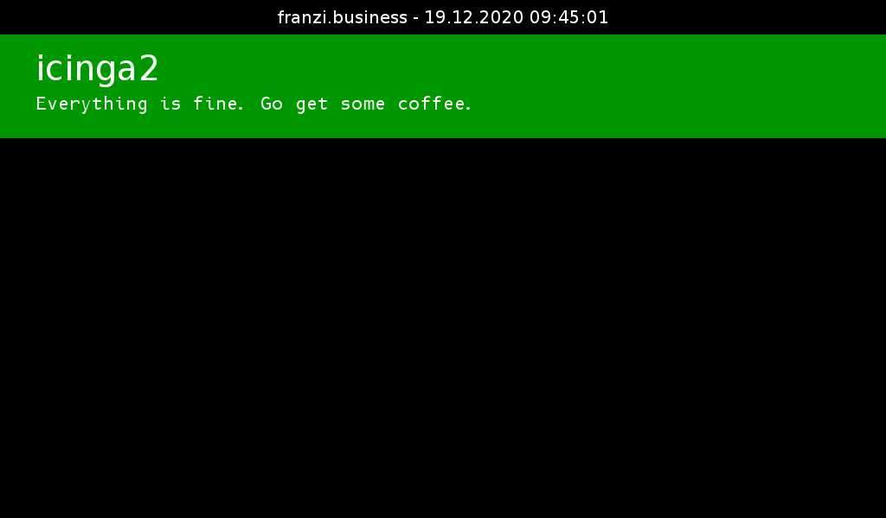

# icinga2beamer

This package will show all non-OK hosts and services checked by an icinga2
instance. Services will be ordered according to their criticality (CRITICAL,
UNKNOWN, WARNING). Hosts which are down are considered CRITICAL.

"Soft" checks will also be taken into account, however they will be put
on the very bottom of the list. "Hard" check results will always be displayed
first.

## icinga2 api permissions

I'd recommend creating a dedicated api user for icinga2beamer. This package
only requires the `objects/query/Host` and `objects/query/Service` api
permissions in icinga2.

## Github Mirror

This package is mirrored to github. However, the most recent version of
the package will be found [on my Gitea instance](https://git.kunsmann.eu/kunsi/icinga2beamer).
Please head there if you want to file any issues.
